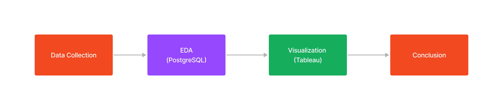
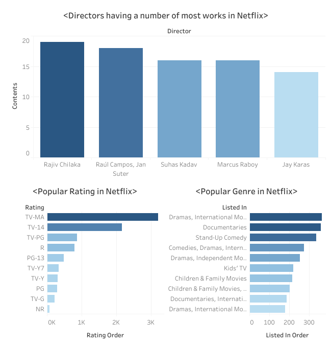
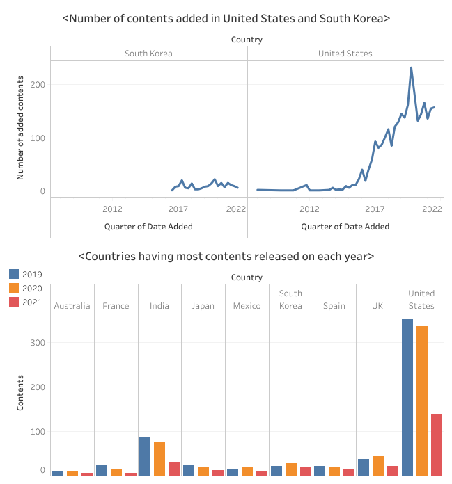
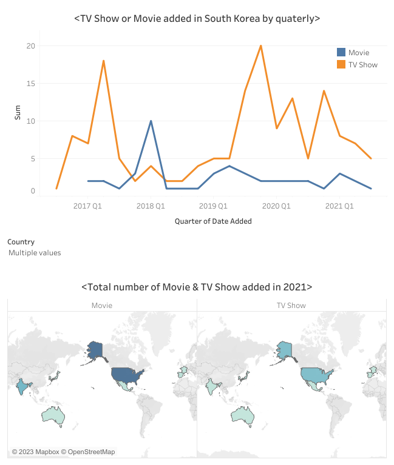

<h1>Netflix Analysis SQL & Tableau</h1>								

By Dongsuk Jeong | November 2022

<h2>Purpose</h2>

  - To explore the Netflix Movies and TV Shows dataset using PostgreSQL 
  - To visualize the result of query using Tableau

<h2>Methodology</h2>								

<h2>Data Collection & Wrangling</h2>

  - Collected Netflix Movies and TV Shows dataset from kaggle 
  - The dataset consists of listings of all the movies and tv shows available on Netflix with details such as cast, directors, ratings, release year, duration, etc

<h2>Exploratory Data Analysis</h2>

  - Check unique value in the column using DISTINCT 
  - Count number of rows where identifier is 'Move' and identifier is 'TV Show' using WHERE 
  - Look up and count the number of rows where the column of listed_in contains word "Family" using LIKE 
  - Check what is the top 5 countries that release the most content on 2021 using GROUP BY and WHERE 
  - Check how many null is in the country column 
  - Look up the movie and tv show added on each months using DATE_TRUNC 
  - Check the most popular genre added by country during April, 2021 using COUNT, GROUP BY, and ORDER BY 
  - Check which country add same genre more than 5 using HAVING 
  - Search how many tv show or movie added by date_added using WITH function

<h2>Tableau Visualization</h2>

<h2>Conclusion</h2>

  - The director having the most work in Netflix is "Rajiv Chilaka" 
  - The most popular rating in Netflix is TV-MA and the most popular genre is Drama, International Movie 
  - Comparing between the number of contents added between South Korea and United States, United States have a lot more contents than South Korea. In addition, both of countries added the most contents in 2021, then decreased 
  - During 2019 to 2021, United States showed the most contents added way more than other countries all of three years 
  - The movie added more than TV show overall countries in 2021

